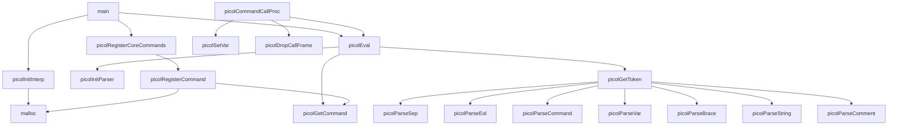
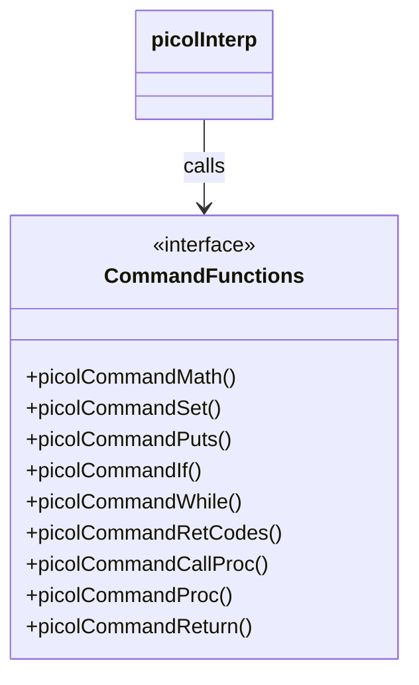
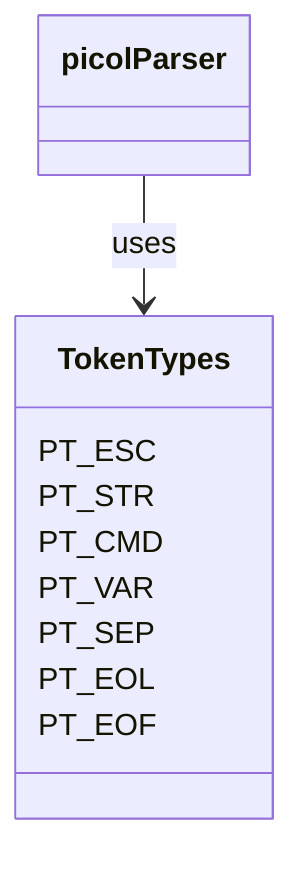
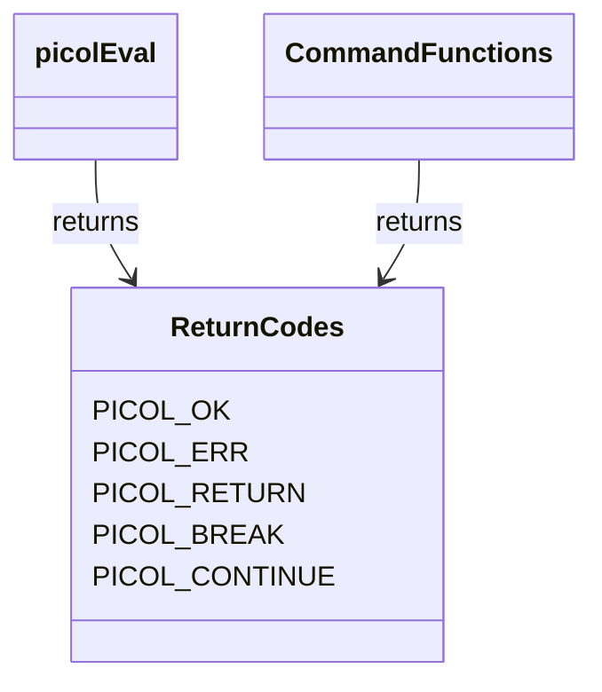
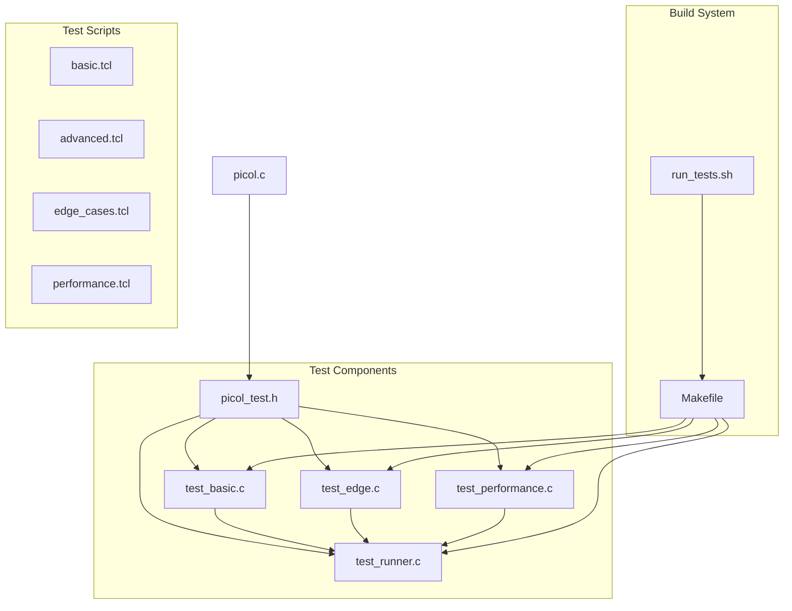
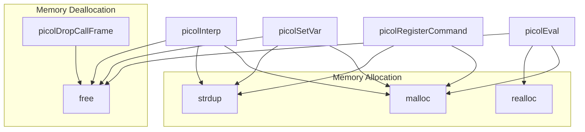
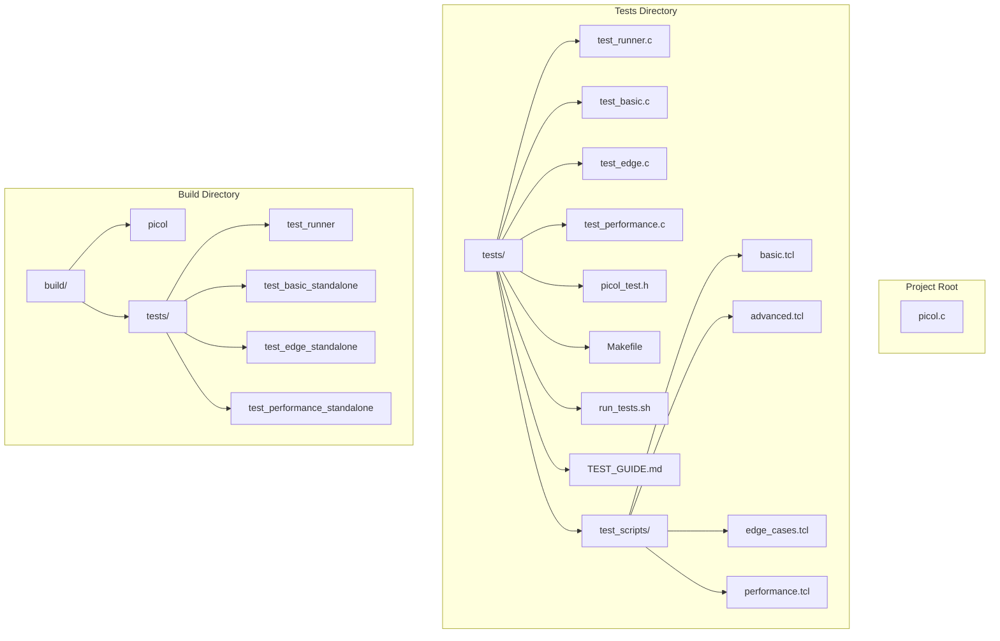

# FILE: /picol-documentation/picol-documentation/docs/project_structure.md
# Picol Project Structure

This document provides an overview of the Picol interpreter's structure using UML diagrams.

## Picol Code Structure Overview

The Picol interpreter is a small Tcl-like language implementation in ~500 lines of C code. Here's an overview of its main components and their relationships based on analysis of the source code.

## Core Data Structures

## Function Relationships

## Core Commands Implementation

## Parser Token Types

## Return Codes

## Test Suite Structure

## Memory Management

## Project File Structure

## Function Summary

| Function | Purpose |
|----------|---------|
| picolInitParser | Initialize the parser with a string to parse |
| picolGetToken | Get the next token from the input |
| picolParseSep, picolParseEol, etc. | Parse specific token types |
| picolInitInterp | Initialize the interpreter structure |
| picolSetResult | Set the result string of the interpreter |
| picolGetVar | Get a variable value by name |
| picolSetVar | Set a variable to a value |
| picolGetCommand | Get a command by name |
| picolRegisterCommand | Register a new command |
| picolEval | Evaluate a Tcl script |
| picolCommandMath, etc. | Core command implementations |

This project structure document uses Mermaid diagrams to visualize different aspects of the Picol interpreter:

1. Core data structures and their relationships
2. Function call relationships
3. Command implementation structure
4. Parser token types
5. Return code enumeration
6. Test suite organization
7. Memory management flow
8. Project file structure

The diagrams provide a clear overview of how the interpreter is structured, which is helpful for understanding the code organization and for onboarding new contributors to the project.