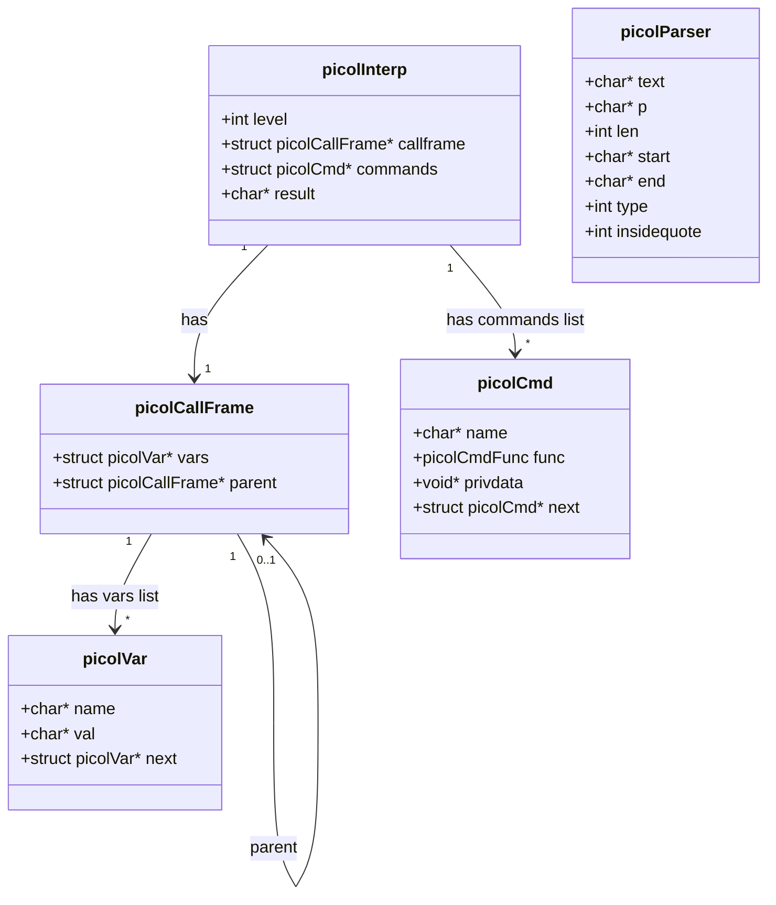
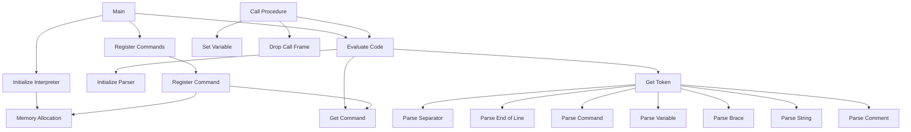
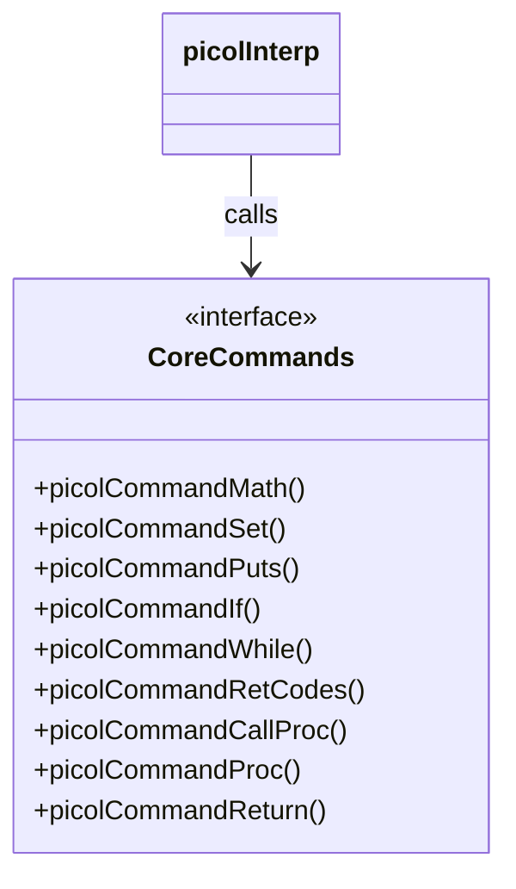
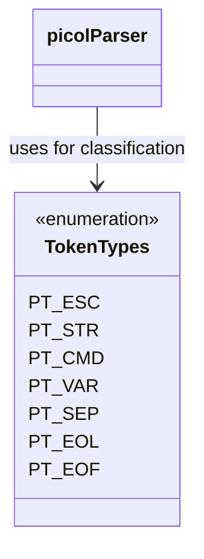
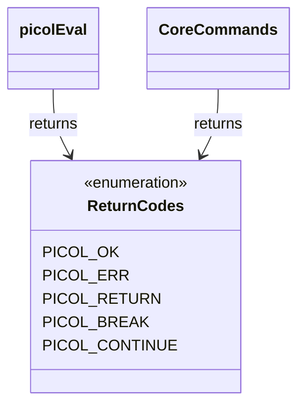
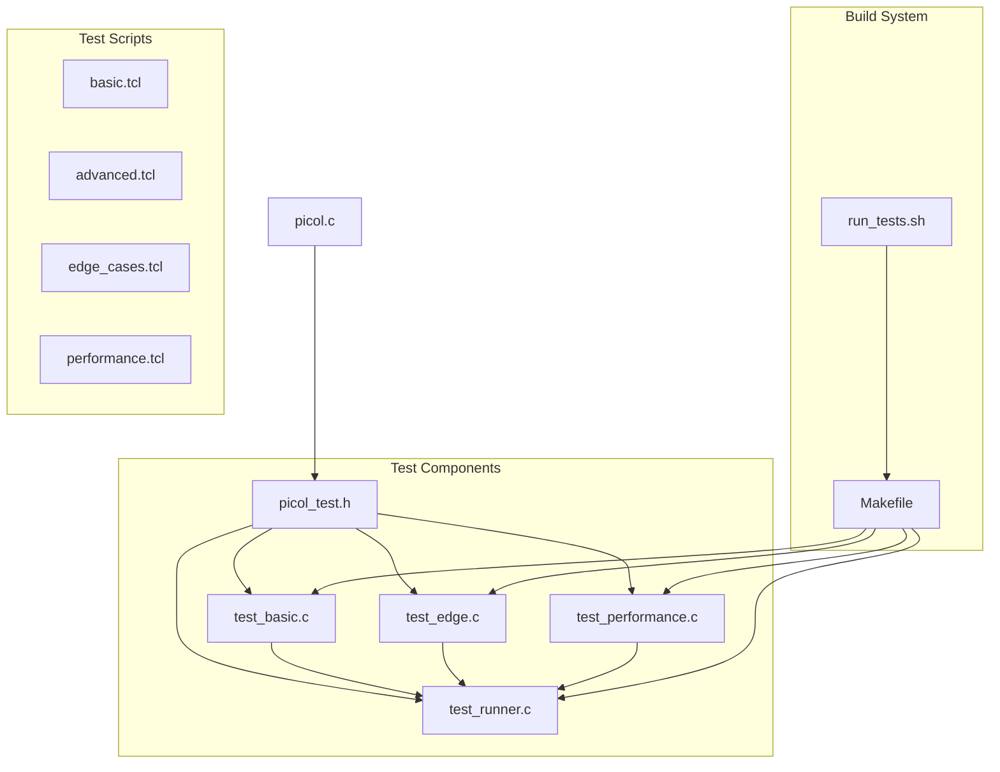
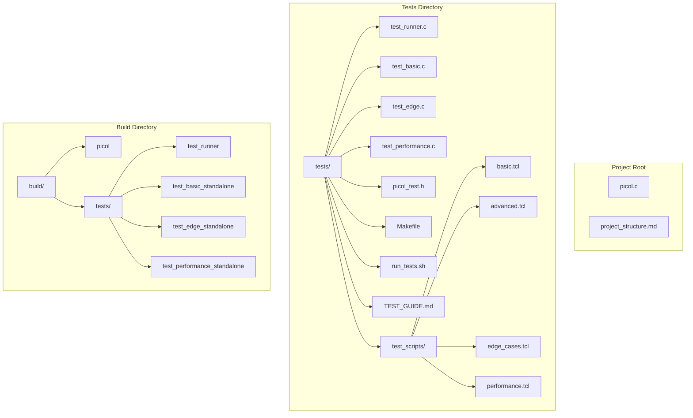

# Picol Project Structure

This document provides an overview of the Picol interpreter's structure using UML diagrams.

## Picol Code Structure Overview

The Picol interpreter is a small Tcl-like language implementation in ~500 lines of C code. Here's an overview of its main components and their relationships based on analysis of the source code.

## Core Data Structures

## Function Relationships

## Core Commands Implementation

## Parser Token Types

## Return Codes

## Test Suite Structure

## Project File Structure

## Function Summary

| Function | Purpose |
|----------|---------|
| `picolInitParser` | Initialize the parser with a string to parse |
| `picolGetToken` | Get the next token from the input |
| `picolParseSep`, `picolParseEol`, etc. | Parse specific token types |
| `picolInitInterp` | Initialize the interpreter structure |
| `picolSetResult` | Set the result string of the interpreter |
| `picolGetVar` | Get a variable value by name |
| `picolSetVar` | Set a variable to a value |
| `picolGetCommand` | Get a command by name |
| `picolRegisterCommand` | Register a new command |
| `picolEval` | Evaluate a Tcl script |
| `picolCommandMath`, etc. | Core command implementations |
| `picolDropCallFrame` | Free a call frame and its variables |
| `picolRegisterCoreCommands` | Register all built-in commands |

The diagrams above provide a clear overview of how the interpreter is structured, which is helpful for understanding the code organization and for onboarding new contributors to the project.

